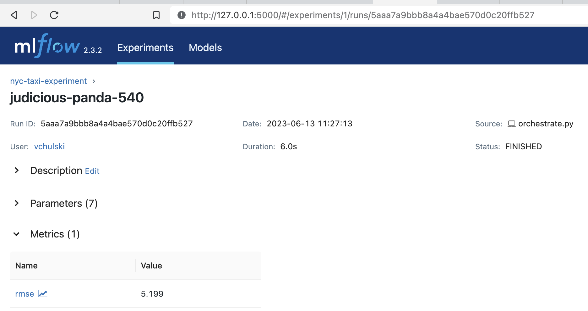
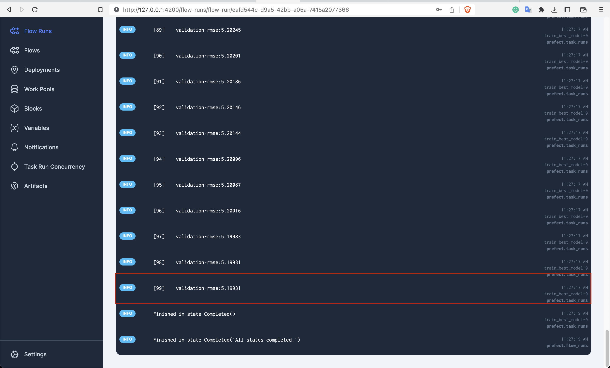
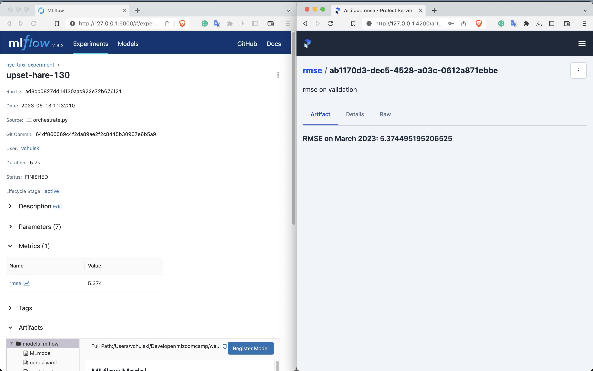
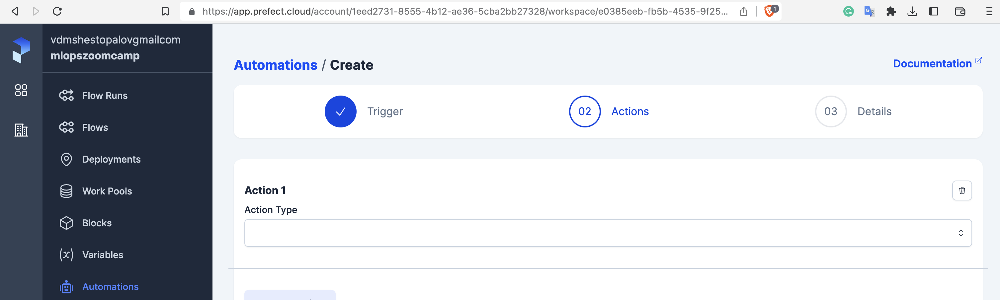

## Week 3 Homework:

### Q1. Human-readable name

Parameter called `name`

### Q2. Cron

The cron schedule for deploying on the third day of every month at 9am UTC would be:

`0 9 3 * *`

In this cron schedule, the five fields represent the following:

Minute: 0 (At 0 minutes past the hour)
Hour: 9 (At 9 AM)
Day of the month: 3 (On the 3rd day)
Month: _ (Every month)
Day of the week: _ (Any day of the week)

### Q3. RMSE

I downloaded data, change data path in `orchestrate.py` and run it.

Then checked results via UI of mlflow and prefect:

### Q4. RMSE (Markdown Artifact)

I changed params in `orchestrate.py` and run it again:

### Q5. Emails

Name of the function is: `email_send_message`

I called an example via `test_email.py` script:

### Q6. Prefect Cloud

1. Trigger
2. **Actions**
3. Details

